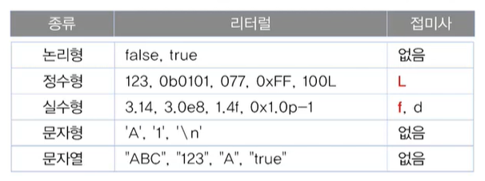

# 자바의 정석 요약

## 변수
- **변수란?**
> 1. 변하는 수, 하나의 값을 저장할 수 있는 메모리 공간    
> 2. 값을 저장할 공간을 마련하기 위해서, 변수를 선언한다.
> 3. 변수의 선언 방법 
> > 변수타입 변수이름;  
> > int age;  //정수 타입의 변수를 선언.
> 4. 변수의 값 저장하기 ( '='는 등호가 아닌 대입연산자 )
> > int age;   
> > age = 25;  
> > => 한줄로 바꾸면, int age = 25;
> 5. 변수의 초기화 - 변수에 처음으로 값을 저장하는 것
> > 주의! 지역 변수는 읽기 전에 꼭! 초기화를 해야함

## 값의 타입
- **data 하위**
> 1. 문자  
> > 1. char  

> 2. 숫자
> > 1. 정수
> > > - byte
> > > - short
> > > - int
> > > - long
> > 2. 실수
> > > - float
> > > - double

> 3. 논리
> > 1. boolean
> > > - true
> > > - false

## 변수, 상수, 리터럴
- **변수**
> 하나의 값을 저장하기 위한 공간 (변경 O)

- **상수**
> 한 번만 값을 저장 가능한 변수 (변경 X)

- **리터럴**
> 그 자체로 값을 의미하는 것 (그냥 상수라 보면 된다, 위의 상수와 구별을 짓기 위해 리터럴이라 부른다.)

`int score = 100;`  
`final int MAX = 100;`  
`char ch = 'A';`  

여기서
- score과 ch는 변수
- 100과 'A'는 리터럴
- final이 붙은 MAX는 상수

## 리터럴의 접두사와 접미사

> 실수형의 d는 생략 가능

## 기본형과 참조형
- 기본형(Primitive type)
> - 실제 값을 저장
> - 오직 8개
> > boolean, char, byte, short, int, long, float, double
- 참조형(Reference type) //무한개 추가 가능
> - 기본형을 제외한 나머지(String, System 등)
> - 메모리 주소를 저장(4 byte 또는 8 byte)
> > Date today;  //참조형 변수 today를 선언  
> > today = new Date();  //today에 객체의 주소를 저장

## Arrays로 배열 다루기
- **배열의 비교와 출력** - equals(), toString()
> - int[ ] arr = {0, 1, 2, 3, 4};  
> - int[ ][ ] arr2D = {{11, 12}, {21, 22}};  
> - 출력시, (Arrays.toString(arr)) // 1차원 배열  
> - (Arrays.deepToString(arr2D))  // 2차원 배열  
> > 비교시, 같은 종류의 배열이 있다면. 아래 예시는 2차원 배열들이다.  
> > Arrays.equals(str2D, str2D2); // false equals는 1차원배열 비교  
> > Arrays.deepEquals(str2D, str2D2); // true 2차원 배열일 때는 deepEquals 사용

- **배열의 복사** - copyOf(), copyOfRange()
> - int[ ] arr = {0, 1, 2, 3, 4};
> - int[ ] arr2 = Arrays.copyOf(arr, arr.length); // arr2 = [0,1,2,3,4]  
> - int[ ] arr3 = Arrays.copyOf(arr, 3) // arr3 = [0,1,2]  
> - int[ ] arr4 = Arrays.copyOf(arr, 7) // arr4 = [0,1,2,3,4,0,0]  
> - int[ ] arr5 = Arrays.copyOfRange(arr, 2, 4) // arr5 = [2,3] <- 4는 불포함
> - int[ ] arr6 = Arrays.copyOfRange(arr, 0, 7) // arr6 = [0,1,2,3,4,0,0]

- **배열의 정렬** - sort()
> - int[ ] arr = {3,2,0,1,4};  
> - Arrays.sort(arr);  // 배열 arr을 정렬한다.
> - Arrays.toString(arr);   // [0,1,2,3,4]

## 객체지향 언어
- 코드의 재사용성이 높고 유지보수가 용이, 중복 코드 제거
- 객체지향 언어 = 프로그래밍 언어 + 객체지향개념
> **OOP(object-oriented programing)의 핵심** 
> > 1. 캡슐화  
> > 2. 상속
> > 3. 추상화
> > 4. 다형성

## 클래스와 객체
- **클래스의 정의:** 클래스란 객체를 정의해 놓은 것  // ex) 제품의 설계도면
- **클래스의 용도:** 클래스는 객체를 생성하는데 사용  
- **객체의 정의:** 실제로 존재하는 것. 사물 또는 개념  // ex) 제품
- **객체의 용도:** 객체가 가지고 있는 기능과 속성에 따라 다름  

## 객체와 인스턴스
- **객체:** 모든 인스턴스를 대표하는 일반적 용어
- **인스턴스:** 특정 클래스로부터 생성된 객체 (예: TV인스턴스)
> 객체와 인스턴스는 같다고 생각하면 됨

## 클래스와 객체
**Q. 클래스가 왜 필요한가?**
> `A. 객체를 생성하기 위해`

**Q. 객체가 왜 필요한가?**
> `A. 객체를 사용하기 위해`

**Q. 객체를 사용한다는 것은?**
> `A. 객체가 가진 속성과 기능을 사용하려고`

## 객체 배열
**객체 배열 == 참조변수 배열**
> Tv tv1, tv2, tv;  =>   Tv[ ] tvArr = new Tv[3]