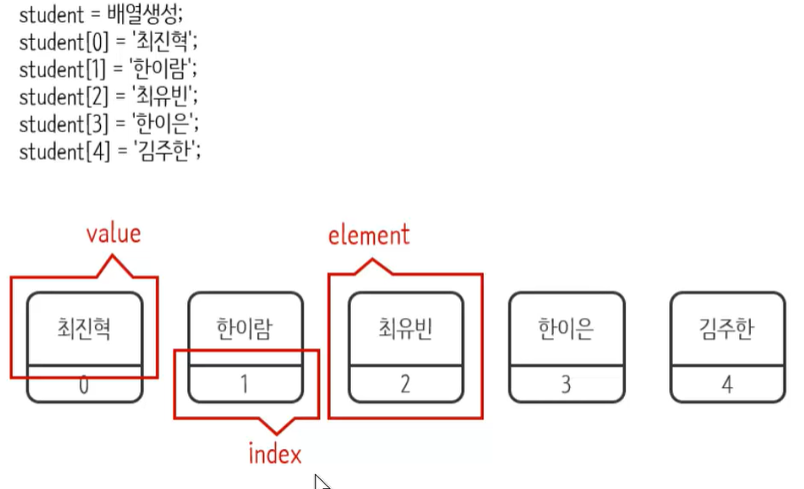
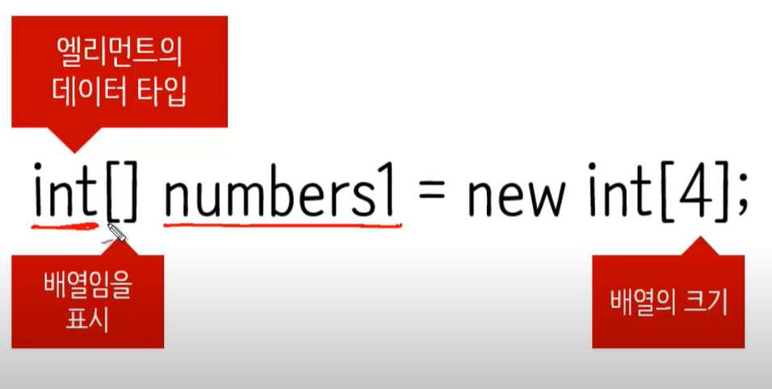
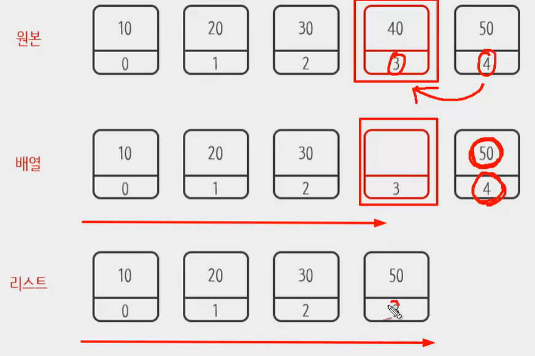
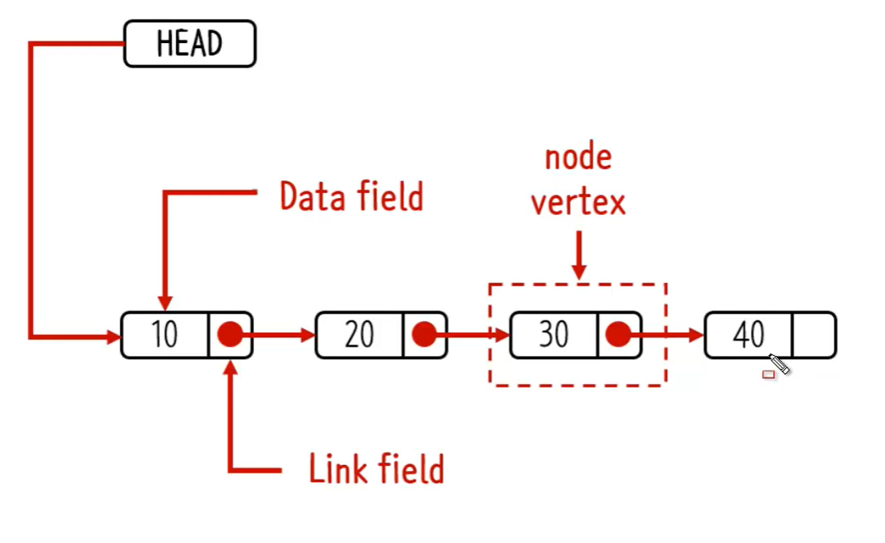
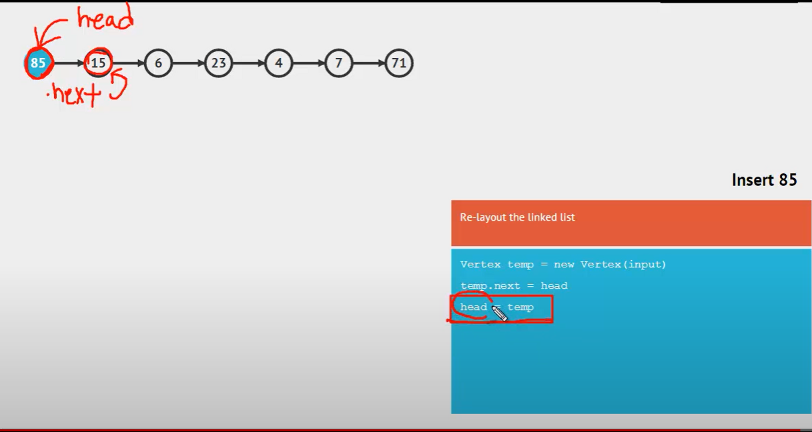
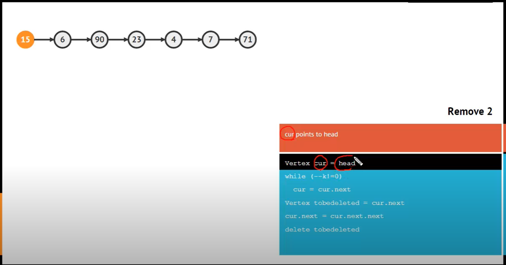

# 자료구조

## Array (배열)
- 여러 데이터를 하나의 이름으로 그룹핑해서 관리하기 위한 **데이터 스트럭쳐**
> 
> - `value`는 값을 나타낸다.
> - `index`는 값들을 식별하는 값이다.
> - `value와 index`가 결합되어 있는 요소가 `element`이다.

> **자바에서의 사용 예시**
> 
> - `int[]` 엘리먼트(`value, index`)의 데이터 타입(`int`), 배일임을 표시(`[]`)
> - `numbers1` 정수형 배열의 변수 이름
> - `new int[4]` 새로운 정수형 배열 생성, 배열의 크기는 4

- 배열(Array)의 단점
> 1. 크기가 정해져 있다.
> 2. 기능이 없다. (데이터를 추가, 삭제, 이동에 관련된 기능)

- 배열(Array)의 장점
> 1. 크기가 정해져 있다. (정해져있기 때문에 작고 가볍다)
> 2. 기능이 없다. (단순하다)
> > `배열은 부품으로 쓰이는 경우가 많다.`

## List

## Array vs Listd
- 리스트는 데이터가 삭제되면, 뒤에 있는 데이터가 앞으로 당겨짐  
- 배열은 데이터가 삭제되면, 그 공간은 빈공간으로 여전히 존재. 즉, 인덱스 값이 변하지 않음.
> 

## Array List
> - 데이터의 추가
> > 1. `addFirst(value)` 0번째 인덱스에 추가한다.
> > 2. `addLast(value)` 마지막 인덱스에 추가한다. 사이즈를 1만큼 늘린다.
> > 3. `add(index, value)` index에 value값을 넣는다. 그 인덱스부터의 value들은 뒤로 한칸씩 밀린다.  
> > `ex) 원본: (0, 10), (1, 20), (2, 30), (3, 40)`  
> > `add(2, 55) ==> (0, 10), (1, 20), (2, 55), (3, 30), (4, 40)`

> - 데이터의 삭제
> > 1. `remove(index)` index에 있는 엘리먼트를 삭제한다. 삭제된 값을 return해준다.
> > 2. `removeFirst` 첫번째의 엘리먼트를 삭제한다.
> > 3. `removeLast` 마지막의 엘리먼트를 삭제한다.

> - 데이터의 조회
> > `get(index)` 인덱스에 있는 값을 리턴한다.  
> > `indexOf(value)` value와 같은값의 index를 반환해준다. 찾는값이 없으면 -1이 리턴된다.

> > `ArrayList는 배열로 이루어져있는데, 그 덕에 index 값으로 조회가 빠르다.`
## Linked List
- 일렬로 연결된 데이터를 저장할 때 사용된다.  
- 데이터를 저장할 수 있는 공간이 있으면 그 안에 다음 데이터의 주소를 가지고 있는 구조

> 메모리 상에서의 상태

> **Array List**
> - 같은 엘리먼트들이 메모리상에 실제 붙어있음

> **Linked List**
> - 엘리먼트들이 흩어져있다. 하지만, 연결되어 있음.

> - `Data field`는 저장되는 값이 들어가 있는 변수필드 
> - `Link field`는 다음 노드를 가리키는 변수필드
> - `node vertex`는 노드를 뜻하고, Data와 Link가 합쳐진 형태이다.

> - `노드 생성 후 첫번째로 만드는 방법`
> - `Vertext temp = new Vertext(input)`으로 노드를 생성
> - `temp.next = head`로 temp의 다음 값을 현재 리스트의 첫번재 값으로 지정한다.
> - `head = temp`로 시작이 되는 노드가 우리가 생성한 temp라고 설정을 한다. 

> - `노드 삭제 방법`
> - `Vertex cur = head`
> - `while (--k!=0)`로 k값이 0이 아닐 때까지 반복 (k는 입력된 인덱스, 여기는 2)
> - `cur = cur.next` k가 0이 아닐때 동안 노드를 가리키는 변수 cur을 다음 노드로 이동
> - `Vertext tobedeleted = cur.next` k가 0일때, 삭제할 노드를 tobedeleted에 담음
> - `cur.next = cur.next.next`로 cur의 다음 노드를 다다음 노드로 가리킴
> > 여기서는 삭제하려고 하는 tobedeleted만이 다음노드를 알기 때문에, 이 행위가 먼저임
> - `delete tobedeleted`로 tobedeleted 삭제