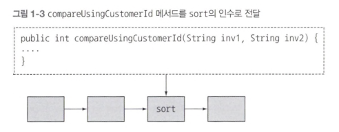
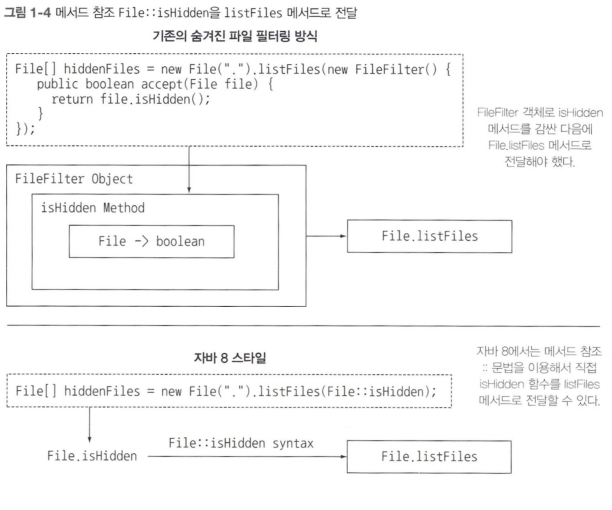

# 모던 자바 인 액션 정리

## 자바 8에서 제공하는 새로운 기술
> - 스트림 API
> - 메서드에 코드를 전달하는 기법
> - 인터페이스의 디폴트 메서드

### 1.2.2 스트림 처리

- 스트림인란 한 번에 한 개씩 만들어지는 연속적인 데이터 항목들의 모임이다.
- 이론적으로 프로그램은 입력 스트림에서 데이터를 한 개씩 읽어 들이며 마찬가지로 출력 스트림으로 데이터를 한 개씩 기록한다.
> 즉, 어떤 프로그램의 출력 스트림은 다른 프로그램의 입력 스트림이 될 수 있다.

스트림 API는 조립 라인처럼 어떤 항목을 연속으로 제공하는 어떤 기능이라고 단순하게 생각하자.

조립 => 조립 => 조립 (이 과정이 한 줄로 이루어짐.)

### 1.2.3 동작 파라미터화로 메서드에 코드 전달하기
- 송장 ID가 여러 개가 존재하고, 이를 정렬해야 한다. sort 메서드에 명령을 내리면 되는데, 두 송장을 비교하는 compareUsingCustomerId 메서드를 구현할 수 있다.
- 그런데, 자바 8 이전의 자바에서는 메서드를 전달할 방법이 없었다.
> 물론, Comparator 객체를 만들어서 sort에 넘겨주는 방법이 있지만, 복잡하고 단순하다.
> > 자바 8에서는 메서드(우리 코드)를 다른 메서드의 인수로 넘겨주는 기능을 제공한다.

이러한 기능을 이론적으로 **동적 파라미터화** 라고 부른다.

### 1.2.4 병렬성과 공유 가변 데이터
1. 병렬성을 공짜로 얻을 수 있다라는 개념에서 시작된다.
> 병렬성을 얻는 대신 무언가를 포기해야 한다.

2. 보통 다른 코드와 동시에 실행하더라도 **안전하게 실행**할 수 있는 코드를 만들려면 공유된 가변 데이터에 접근하지 않아야 한다.
> 이러한 함수를 순수함수, 부작용 없는 함수, 상태 없는 함수라 부른다.

* 기존처럼 synchronized를 이용해 공유된 가변 데이터를 보호하는 규칙을 만들 수는 있다.
* 일반적으로 synchronized는 시스템 성능에 악영향을 미친다.
- 자바 8 스트림을 이용하면 기존의 자바 스레드 API보다 쉽게 병령성을 활용할 수 있다.

3. 공유되지 않은 가변 데이터, 메서드, 함수 코드를 다른 메서드로 전달하는 두 가지 기능은 **함수형 프로그래밍** 패러다임의 핵심적인 사항이다.
4. 반변 명령형 프로그래밍 패러다임에서는 일련의 가변 상태로 프로그램을 정의한다.

### 1.3 자바 함수
#### 람다 : 익명 함수
- 자바 8에서는 메서드를 일급값으로 취급할 뿐 아니라 람다를 포함하여 함수도 값으로 취급할 수 있다.   
> ex) (int x) -> x + 1, x라는 인수로 호출하면 x + 1을 반환  

> 람다 문법 형식으로 구현된 프로그램을 함수형 프로그래밍, 즉 '함수를 일급값으로 넘겨주는 프로그램을 구현한다'라고 한다.  

